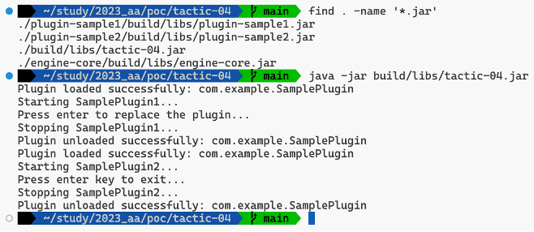

# Tactic 04 - Runtime Plugin Loading

Java의 경우 URLClassLoader 를 이용해 Jar 파일에서 클래스를 로드하여 플러그인 레지스트리에 등록하는 방식으로 플러그인 동적 로딩을 구현할 수 있다.

## 빌드 및 실행

```
gradle build
java -jar ./build/libs/tatic-04.jar
```

### 실행 결과



## 빌드 아티팩트

```
./build/libs/tactic-04.jar
./engine-core/build/libs/engine-core.jar
./plugin-sample1/build/libs/plugin-sample1.jar
./plugin-sample2/build/libs/plugin-sample2.jar
```

## 프로젝트 구조

```
.
├── build.gradle
├── settings.gradle
├── engine-core
│   ├── build.gradle
│   └── src
│       └── main
│           └── java
│               └── com
│                   ├── example
│                   │   ├── IPlugin.java
│                   │   └── PluginManager.java
│                   └── resources
├── plugin-sample1
│   ├── build.gradle
│   └── src
│       └── main
│           └── java
│               └── com
│                   └── example
│                       └── SamplePlugin.java
├── plugin-sample2
│   ├── build.gradle
│   └── src
│       └── main
│           └── java
│               └── com
│                   └── example
│                       └── SamplePlugin.java
└── src
    └── main
        └── java
            └── com
                └── example
                    └── Main.java
```