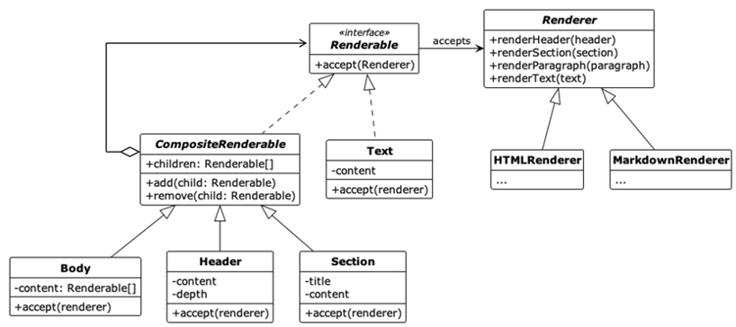

# Tactic 11 - Apply Visitor Pattern for Report Types

## 소개

Operation Report 의 템플릿을 사용자 입맛에 맞게 Customizing 하고 싶을 경우 사용자가 원하는 모든 요구사항을 상속으로 해결하기 어렵다. 이를 해결하기 위해 다음과 같은 2가지 패턴을 적용하여 리포트 형식의 가변성을 극대화 할 수 있다.

-	레포트의 출력 결과를 Composite 패턴이 적용된 Renderable 객체로 변환
-	Renderable객체를 Visitor 패턴으로 다양한 포멧으로 렌더링



## 실행 방법

```
python ReportGeneratorPoc [html|markdown]
```

## 실행 예제

